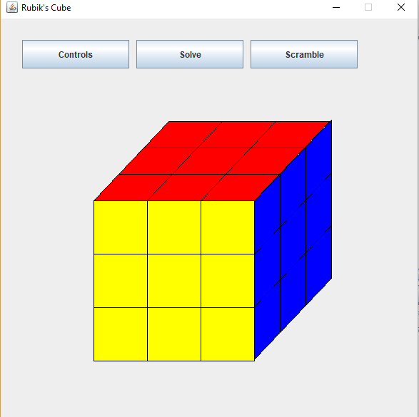
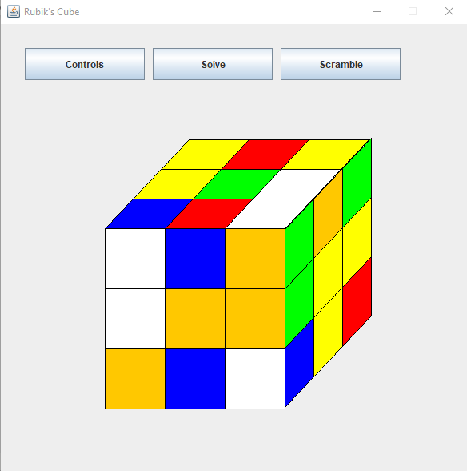
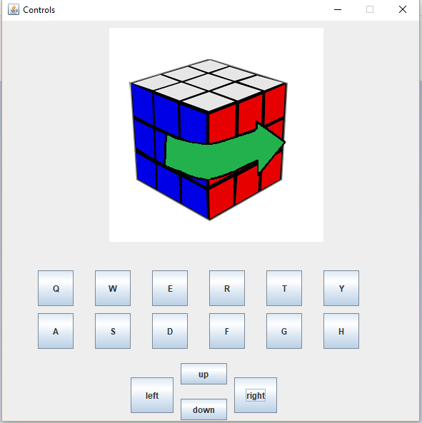

**What is it?** Rubiks Cube Simulator. You can turn each side or rotate the entire cube. Also has a handy screen for remembering the controls and a self scrambler. Solver is currently not functioning

**Project Goals, Skills, and Tools**
This was one of the first programming projects I came up with, designed, and created for fun rather than class. My main goal was to apply the OOP concepts I learned in class on a larger scale. Though I didn't set out to use any new tools or libraries, along the way I picked up some skills that because useful:
* Threading was completely new to me, but necessary to learn in order to create a graphical interface in java
* Having a gui was also novel. This was the first time I had to distinguish between what needs to be seen by a user, what is useful to be seen while programming, and what should stay hidden.
* Designing on a high level and a low level. Rather than classwork that mostly provides a framework for students to fill in, I started from scratch. This meant I had to figure out what classes should exist, what functions they should perform, and how to perform them.

**Reflection**
Since I was learning good design practices, I put a lot of thought into what things should be in seperate classes and how data should be shared between them. Looking back on this project several years later I'm pleasantly surprised how organized it is, given my limited knowledge of data structures and limited experience designing programs. This was my first time encountering threads and creating a graphical interface rather than printing to the console. Both of these required a lot of research in order to implement. I'm particularly proud of this project even if its not the most interesting or the cleanest because it was the first time I took inititive to make something I want and I learned a lot from the process.

